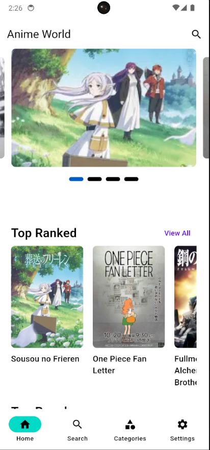

# AnimeView Flutter App

## Overview
The **AnimeView Flutter App** is a mobile application built using Flutter, which interacts with the **MyAnimeList API** to display a variety of anime information. The app allows users to explore top-ranked, most popular, and seasonal animes. It also includes a search functionality to find specific anime titles.

---

## Features
- **Anime Listings**: View top-ranked, popular, and seasonal animes.
- **Search Anime**: Users can search for anime by titles.
- **Category-Based Anime**: Browse anime by categories.
- **Seamless Navigation**: Bottom navigation bar for switching between views.

---

## Screenshots

Here are some screenshots showcasing the app's main features:

<table>
  <tr>
    <td><strong>Home Screen</strong></td>
    <td><strong>Search Screen</strong></td>
    <td><strong>Anime Details</strong></td>
  </tr>
  <tr>
    <td></td>
    <td></td>
    <td></td>
  </tr>
</table>

---

## Installation

### Prerequisites
- **Flutter SDK**: Ensure you have Flutter installed. Follow the [installation guide](https://flutter.dev/docs/get-started/install).
- **Dart SDK**: This comes pre-installed with Flutter.
- **MyAnimeList API Key**: You will need to get an API key from [MyAnimeList API](https://myanimelist.net/apiconfig).

